<div align="center">


<h1>Chrysalis</h1>

<strong>Sync Monarch Money balances into ProjectionLab — in one click.</strong>

<p>🟧 <strong>Monarch</strong> <em>(source)</em> &nbsp;→&nbsp; 🟦 <strong>ProjectionLab</strong> <em>(destination)</em></p>

<p>
  <a href="https://chromewebstore.google.com/detail/chrysalis/jjlpglgnadfdnfflgnpgcamfeacbhood"></a>
  &nbsp;
  
</p>

</div>

Chrysalis is a Chrome extension that pulls your live account balances from Monarch Money and pushes them into ProjectionLab with one click. No scripts, no terminal, no copy-pasting numbers by hand.

Chrysalis is, and will always be, **free** to use. But if you want to say thank you, [coffee is my love language](https://ko-fi.com/tylerclass).

---

## 📣 Release Announcement — v1.1.0 (2026-06-02)

This version is a total visual refresh — a top-to-bottom redesign of Chrysalis's
interface and a new logo. There are **no changes to core functionality**, but the tool
should be more enjoyable to use and easier to navigate and understand with the new UI.

<details>
<summary><strong>Recent release — v1.0.6</strong></summary>

<br>

**v1.0.6** focused on compatibility and reliability:

- **Works on Chromium browsers beyond Chrome** (Dia, Arc, Brave, Edge, Opera, Vivaldi)
  — the **Setup** button now opens reliably everywhere.
- **Fixed Monarch "Failed to fetch."** Auth now uses the Monarch tab's CSRF token (a
  `MAIN`-world script) with **no new browser permissions**. _(#13, #17, #18, #19, #21)_
- **ProjectionLab Early Access is a manual opt-in** toggle in Setup, rather than being
  chosen automatically. _(#14)_
- **Account-mapping storage** is chunked so larger setups don't hit Chrome's
  `storage.sync` per-item limit. _(Thanks @billda — #10)_
- **Coinbase balances** that report a zero `currentBalance` now sync the displayed
  value. _(Thanks @billda — #12)_
- **In-app announcement banner** added to the popup.

_Credits: CSRF auth fix by @seanius (#22), `MAIN`-world approach suggested by
@incorvia; storage & Coinbase fixes by @billda._

</details>

---

## 🤔 Why Chrysalis?

ProjectionLab is a powerful financial planning tool, but it need an accurate starting point for projections. Monarch Money knows exactly what your accounts are worth. Chrysalis serves as the bridge between the two, so your plan stays grounded in your actual balances without manual data entry.

There are a couple of workarounds floating around the internet, but they had various issues and I wanted a full-service product experience... so I built it. My goal with Chrysalis is to make a full-featured, polished integration between Monarch and ProjectionLab.

---

## ✅ Requirements

- Google Chrome or a Chromium browser (I like Dia), **or Firefox 128+**
- A [Monarch Money](https://monarchmoney.com) account
- A [ProjectionLab](https://projectionlab.com) account with Plugins enabled
- Your accounts must already exist in ProjectionLab (Chrysalis updatesPL  balances, it cannot create accounts)

---

## 📦 Installation

Chrysalis is [available on the Google Chrome Web Store](https://chromewebstore.google.com/detail/chrysalis/jjlpglgnadfdnfflgnpgcamfeacbhood). Just click "Add to Chrome" to get started.

The Chrysalis icon will appear in your Chrome toolbar. Pin it for easy access.

---

## ⚙️ Setup

Setup takes about two minutes and only needs to be done once. Before you ever configure your settings, the popup will indicate that setup is required.

<kbd>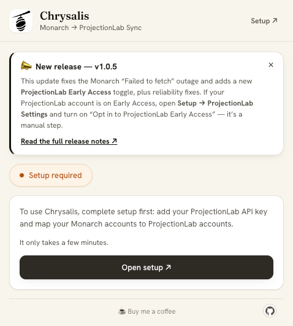</kbd>

Click the Chrysalis icon and then click **Setup ↗** in the top-right corner of the popup to open the setup page.

<kbd>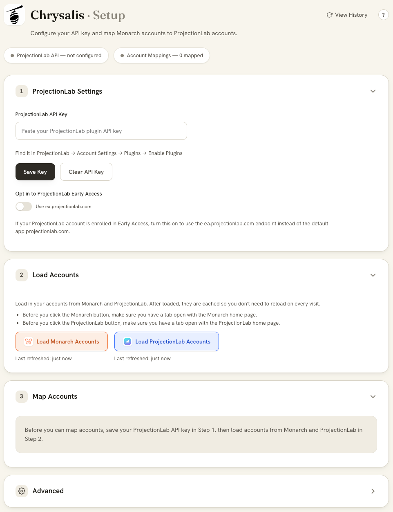</kbd>

### Step 1 — Set up ProjectionLab

Chrysalis uses ProjectionLab's official Plugin API to update your account balances. You need to enable this and generate a key:

1. Log into [ProjectionLab](https://app.projectionlab.com)
2. Go to **Account Settings** (top-right menu) → **Plugins**
3. Toggle **Enable Plugins** on
4. Copy the value shown in the **Plugin API Key** field

Paste it into the **ProjectionLab API Key** field in Chrysalis and click **Save Key**.

**ProjectionLab Early Access (optional):** Most people should skip this — by default Chrysalis uses the standard `app.projectionlab.com`. If your ProjectionLab account is enrolled in the Early Access program (`ea.projectionlab.com`), flip on the **Opt in to ProjectionLab Early Access** toggle (below the Save/Clear buttons) so account loading and balance syncs use the Early Access endpoint instead.

### Step 2 — Load your accounts

Before you can map anything, Chrysalis needs to fetch your account lists from both services.

1. Make sure you're logged into Monarch Money. Have `app.monarchmoney.com` open in a tab
2. Click **Load Accounts from Monarch**. You should see success text underneath the button
3. Make sure you're logged into ProjectionLab in an open tab — `app.projectionlab.com`, or `ea.projectionlab.com` if you enabled Early Access in Step 1
4. Click **Load Accounts from ProjectionLab**. You should see success text underneath the button
5. Anytime you add/remove/rename accounts in either tool, come back to Setup the click the corresponding buttons, which will then say "Refresh Accounts from Monarch/ProjectionLab". Your mappings are keyed by ID and will be preserved even if you change the name of an account.

### Step 3 — Map your accounts

This is where you tell Chrysalis which Monarch account corresponds to which ProjectionLab account.

Each row represents one **ProjectionLab account** (the destination). On the left side, you select one or more **Monarch accounts** to map to it.

**One-to-one mapping** (most common): select one Monarch account on the left, one ProjectionLab account on the right.

<kbd>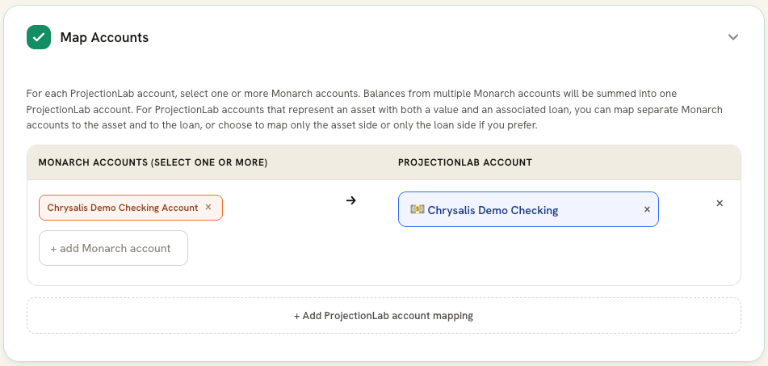</kbd>

**Many-to-one mapping**: if you have multiple Monarch accounts that should roll up into a single ProjectionLab account — for example, two checking accounts that map to one "cash" entry — select all of them on the left. Chrysalis will sum their balances before syncing.

<kbd>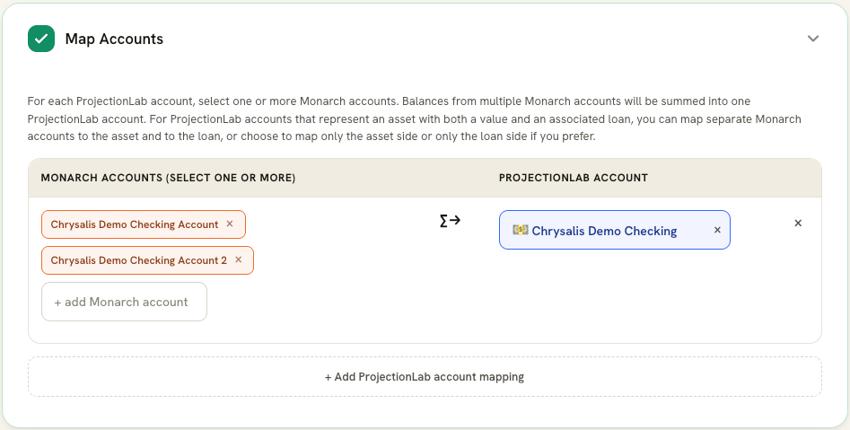</kbd>

To add a mapping:

1. Use the **+ add Monarch account** dropdown to select a Monarch account — it will appear as a chip
2. Add more Monarch accounts to the same row if needed
3. Select the corresponding ProjectionLab account on the right
4. Click **+ add PL account mapping** to add another row for a different PL account

Mappings are saved automatically. When a row is completed, a green checkbox appears on the right indicating it has been saved. When all ProjectionLab accounts have been mapped, a green success message appears at the bottom of the section and the "Add ProjectionLab account mapping" button is hidden.

You are not required to map every account, only map the ones you want Chrysalis to sync.

When your setup is complete, you'll see green visual feedback indicating each section is done, as below:

<kbd>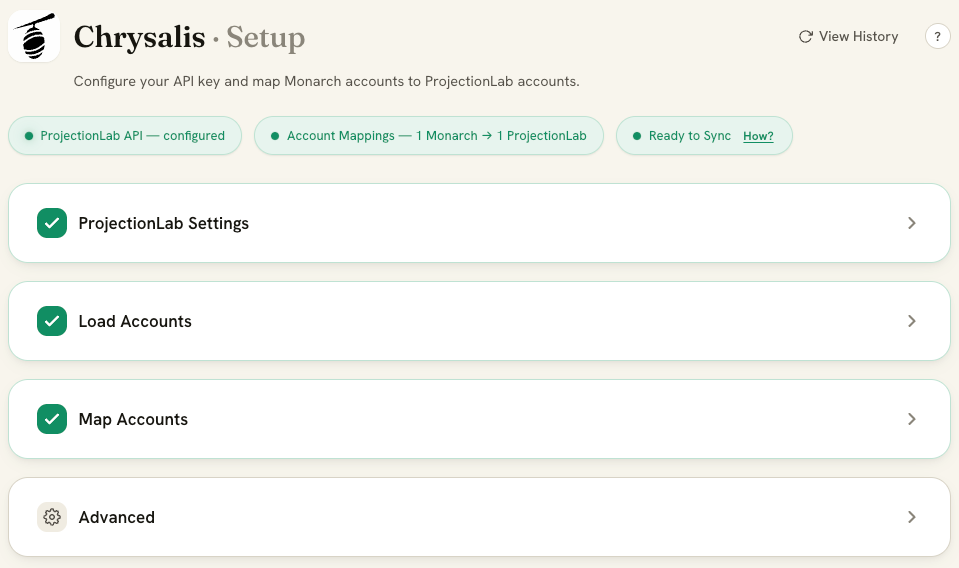</kbd>

**Special mapping for assets**: Monarch and ProjectionLab work differently in terms of how the data is structured for various types of assets (real estate, cars, motorcycles, jewelry, precious metals, etc.). Monarch stores an asset's value and a loan against that asset as *2 separate accounts*, while ProjectionLab has both the value of an asset and a loan against an asset in *1 account*. Don't fret, the mapping of this kind of asset is **fully supported**.

When you select a ProjectionLab account that is one of these asset types, the row switches to a 2-lane layout that supports both the Asset and the Loan amount for that ProjectionLab account. On the Monarch side, you choose the Asset and Loan accounts individually. When synced to ProjectionLab, the Asset and Loan amounts from the 2 separate Monarch accounts are automatically merged into the 1 ProjectionLab account in the correct target fields.

<kbd>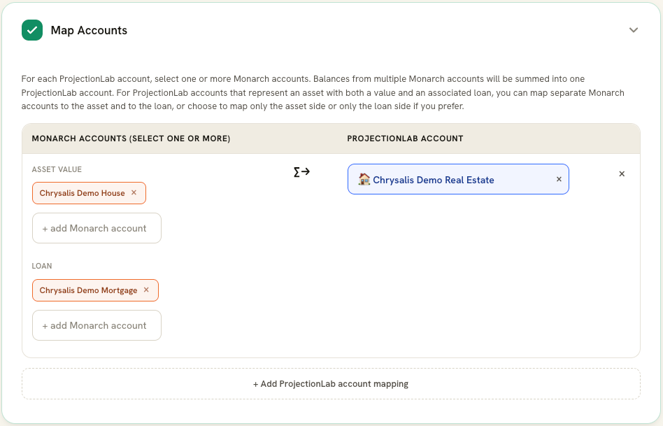</kbd>

### Sync Accounts

Once setup is complete, syncing is a one-step process:

1. Navigate to `app.monarchmoney.com` in Chrome (and make sure you're logged in)
2. Click the Chrysalis icon in your toolbar
3. Click **Sync Now**

<kbd>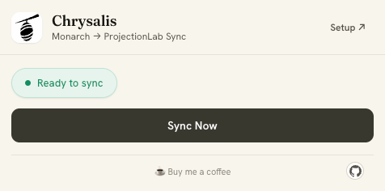</kbd>

The sync button is only active when you're on the Monarch site. This is intentional — Chrysalis reads your session directly from the Monarch page, so the page needs to be open. If you're on a different tab and click the popup, it instructs you to go to a Monarch tab first before you can sync, as seen here:

<kbd>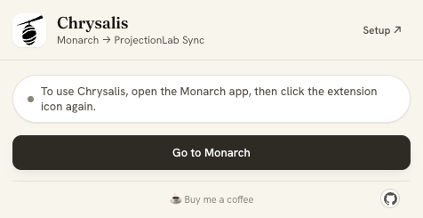</kbd>

After you have at least 1 sync in the cache, the popup will also include details about the past syncs. An expandable gray section appears showing you the most recent sync job that occurred. You also have links out to each sync in memory in the table below. Clicking **View History** opens the Sync History page, while clicking a row in the table opens that specific record.

<kbd>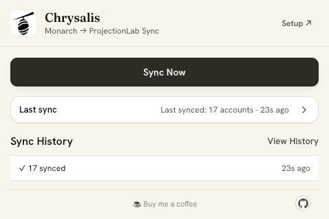</kbd>

---

## 🔬 How it works

### Authentication

Chrysalis never sees or stores your Monarch or ProjectionLab username or password.

**Monarch** is authenticated by reusing the session you're already logged into. When you sync, Chrysalis reads the CSRF token that Monarch's web app keeps in the page — via a `MAIN`-world script injected into your open Monarch tab — and sends it together with your browser's existing Monarch session cookies on the API request. Because it rides on your existing session, there are no credentials to store and **no extra browser permissions** are required (notably, the `cookies` permission is *not* used). This is also why syncing only works while a Monarch tab is open.

**ProjectionLab** is authenticated with the Plugin API key you saved in Step 1. Requests go to `app.projectionlab.com` by default, or `ea.projectionlab.com` if you opted into Early Access.

### Fetching balances

Once authenticated, Chrysalis makes a GraphQL request directly to Monarch's API — the same endpoint the Monarch web app uses — and retrieves the current balance for each of your mapped accounts.

### Updating ProjectionLab

Chrysalis calls ProjectionLab's official Plugin API for each mapped account, sending the current balance. If you have multiple Monarch accounts mapped to one ProjectionLab account, Chrysalis sums the balances first, then makes a single API call with the total.

### What stays on your machine

*Everything.* Your API key is stored in Chrome's extension storage. Your account mappings are stored there too, and sync across your Chrome profiles if you're signed into Chrome. No data is sent to any server other than Monarch and ProjectionLab's own APIs.

---

## ✨ Other features

### Sync results

After each sync, the popup shows a per-account breakdown:

- ✓ Each successfully updated account, with the balance that was written and the Monarch source(s) it came from
- ✗ Any accounts that failed, with the specific error
- ⚠ A warning if some (but not all) source accounts in a many-to-one mapping couldn't be found — Chrysalis will still sync using the accounts it could find

The result list stays visible until you run the next sync, so you can close and reopen the popup without losing the last run's details. The most recent sync section collapses after 5 seconds, but you can always re-expand it as you like.

<kbd>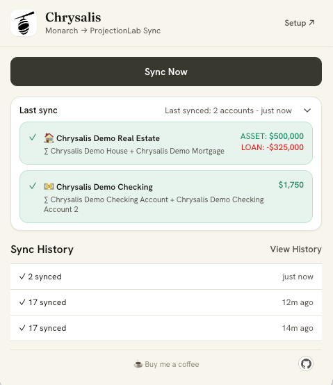</kbd>

### Sync history

Click **View History** on the setup page, or the same link in the extension popup when you are on a Monarch tab. The Sync History keeps a log of recent syncs with timestamps and outcomes including the Monarch accounts synced to which ProjectionLab target accounts, the amount that was synced (positive or negative), and a status of that account's sync job. Useful for confirming a sync ran correctly or diagnosing a pattern of failures. The most recent Sync History shows up under a collapsed gray section on the popup after you have run at least 1 sync.

<kbd>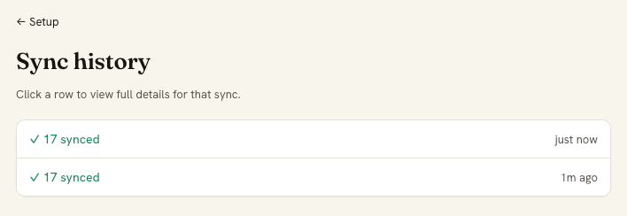</kbd>

<kbd>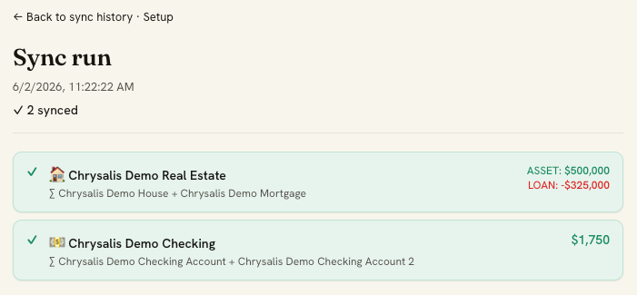</kbd>

### Partial sync behavior

If one of your mapped accounts is deleted or hidden in Monarch after you set up a mapping, Chrysalis will:

- Skip that account with an error rather than writing a wrong balance
- Still sync all other accounts that resolved correctly
- Report partial success so you know something needs attention

---

## 🛠️ Advanced

The **Advanced** section lives at the bottom of the setup page. It's collapsed by default and intended for diagnostics and data management. You won't need it during normal use.

<kbd>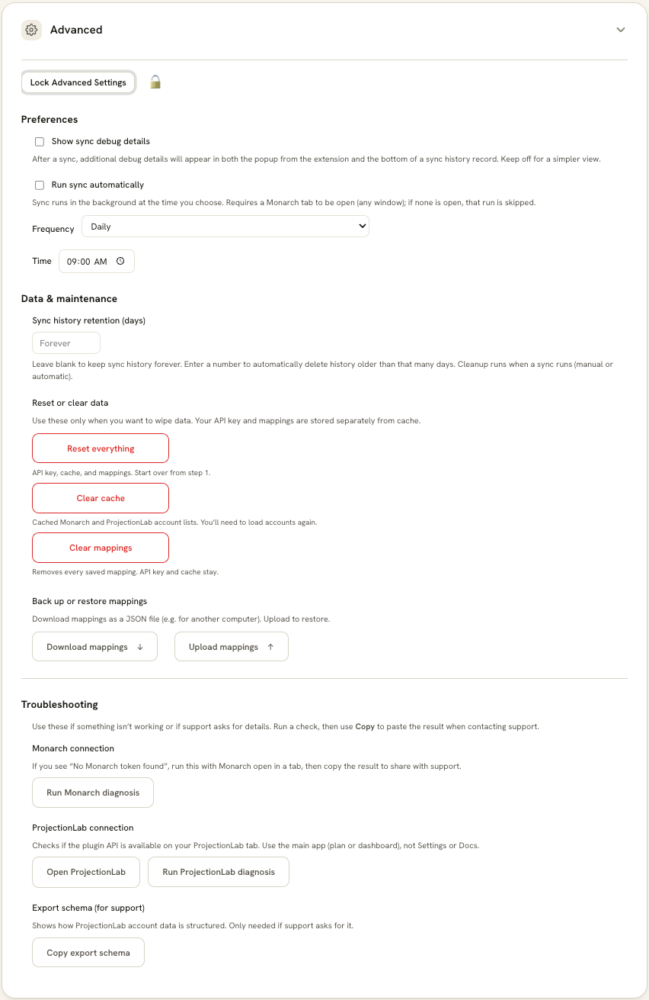</kbd>

### Lock / Unlock Advanced Settings

To help ensure people don't accidentally take an unreversible action on their Chrysalis instance, the Advanced section is locked. Click "Unlock Advaned Settings" to enable the section, and it can be re-locked when you're done.

### Show sync debug details

This checkbox will inject more detailed, technical debug details in 2 places: (1) on the extension popup after a sync job has run, and (2) at the bottom of any sync record under Sync History. If something is wonky, this is a good place to start.

### Run sync automatically

If you want to, you can enable a time-based sync job daily, weekly, monthly, or quarterly, and you can choose the day or week or day of month and time of day for it to run. **Note:** The scheduled job will only work if the base conditions are met for processing, being that you must have Google Chrome open, your computer awake, and a Monarch tab must be open in your browser in an active session.

### Sync history retention

If you want to automatically clear out your sync history data based on their age, you can use this as a TTL (time-to-live) setting. Enter the number of days that is the acceptable age of sync history records. When they have passed this age, they will be automatically deleted when the next sync job runs. If you leave this blank, records will be retained forever (or, until you manually delete them - see below).

### Reset / Clear Data

#### "Reset Everything"

This button does just that. It clears your API key, account mappings, and cache all in 1 click. This is effectively a full reset.

#### "Clear cache"

This button clears your cache, including sync history and account lists. Your account mappings and API key are retained.

#### "Clear mappings"

This button only clears your account mappings, but keeps your API key and cother cached data in place.

### Back up or restore mappings

This section has 2 buttons: one to download your current mappings as a JSON file, and another to upload mappings. This is useful if you need to migrate your Chrysalis settings from one computer to another. Or, if you are someone who clears your cache a lot if for software development purpuoses or what have you, then you might want to keep your account mappings saved to your local machine to re-upload when you're ready to sync again. The upload takes <1 second, and replaces any pre-existing mappings that may be there.

---

## 🚑 Troubleshooting

**"Failed to fetch" or Monarch accounts won't load**

Make sure you're logged into Monarch Money and that the Monarch tab is open when you sync (Chrysalis reads its auth from that tab). Try refreshing the Monarch page and syncing again. If you're still having issues, go to the Advanced section under Setup and click the "Run Monarch diagnosis" button. It will generate some text that should help you solve the issue.

**"ProjectionLab plugin API not found"**

Plugins are not enabled in your ProjectionLab account. Go to Account Settings → Plugins and toggle them on. If ProjectionLab still won't connect after your API key is enabled and entered in Setup, then go to the Advanced section under setup and click the "Run ProjectionLab diagnosis" button. It will generate some text that should help you solve the issue.

**Balances look wrong after sync**

Check the sync result detail in the popup — if a many-to-one mapping is partially resolving (some source accounts missing), the balance shown will be lower than expected. Update your mappings to reflect your current Monarch accounts.

**Still stuck, or something looks like a bug? [Open an Issue](https://github.com/tyler-class/Chrysalis/issues) on the GitHub repo.**

---

## ⚠️ Known limitations

- Chrysalis requires the Monarch tab to be open when syncing. This is a trade-off for not needing to store your credentials.
- ProjectionLab accounts must already exist. Chrysalis cannot create new accounts, only update balances on existing ones. This is a limitation of the ProjectionLab API which does not expose any "create account" method.
- This uses Monarch's internal GraphQL API, which is unofficial and unversioned. It could change without notice. See [Contributing](#contributing) for how to report or fix breakage.

---

## 🧱 Building from source (Chrome & Firefox)

Chrysalis ships from **one shared source tree** that builds both a Chrome and a
Firefox extension. The only things that differ per browser are the manifest and
a thin `browser.*` compatibility shim — all business logic, content scripts, and
background logic are shared.

### How it's wired

- **Source** lives at the repo root (`background/`, `content-scripts/`,
  `popup/`, `setup/`, `sync-history/`, `shared/`). All extension code calls the
  promise-based **`browser.*`** API.
- **`webextension-polyfill`** is inlined into every bundle at build time
  (via esbuild's `inject`), so `browser.*` works identically on Chrome
  (where it wraps `chrome.*`) and Firefox (native).
- **Manifests** are composed from `manifests/manifest.base.json` plus a small
  per-browser override (`manifest.chrome.json` / `manifest.firefox.json`). Chrome
  uses `background.service_worker`; Firefox uses `background.scripts` (event
  page), because Firefox does not support service-worker backgrounds.
- **`scripts/build.mjs`** bundles each entrypoint with esbuild and emits a
  ready-to-load extension into **`dist/chrome`** and **`dist/firefox`**.

### Commands

```bash
npm install            # one-time: esbuild, web-ext, webextension-polyfill

npm run build          # build BOTH targets → dist/chrome and dist/firefox
npm run build:chrome   # build only dist/chrome
npm run build:firefox  # build only dist/firefox

npm run lint:firefox   # web-ext lint on dist/firefox (manifest + compat checks)
npm run start:firefox  # web-ext run: launch Firefox with the extension loaded
```

To load a build manually:

- **Chrome:** `chrome://extensions` → enable Developer mode → **Load unpacked** →
  select `dist/chrome`.
- **Firefox:** `about:debugging#/runtime/this-firefox` → **Load Temporary
  Add-on** → pick any file inside `dist/firefox` (or use `npm run start:firefox`).

> **Note:** you now load the built `dist/<browser>` folder, not the repo root.
> The repo root is no longer directly loadable because the source uses ES module
> imports that the build resolves.

### Firefox specifics

- **Minimum Firefox version is 128** (`strict_min_version` in the Firefox
  manifest). This is required: the ProjectionLab sync relies on
  `scripting.executeScript({ world: "MAIN" })`, which Firefox only supports from
  version 128.
- **The `browser_specific_settings.gecko.id` in `manifests/manifest.firefox.json`
  is a placeholder** (`PLACEHOLDER-REPLACE-ME@chrysalis.example`). Replace it with
  the real extension ID before submitting to AMO.

---

## 🤝 Contributing

Contributions are welcome, especially fixes when Monarch or ProjectionLab change their APIs.

**When Monarch breaks auth or account fetching**, the relevant file is `content-scripts/monarch.js`. Auth relies on the CSRF token read from the logged-in Monarch tab (a `MAIN`-world script) plus the existing session cookies; the auth and request-building logic is at the top of that file.

**When ProjectionLab's Plugin API changes**, the relevant call is in `background/service-worker.js`.

When you [open an Issue](https://github.com/tyler-class/Chrysalis/issues), please include:

- What error you saw (exact text)
- Whether the Monarch web app itself was working normally at the time
- Your browser and version (e.g. Chrome 138, Firefox 130)

---

## ⚖️ Disclaimer

Chrysalis is an independent project and is not affiliated with, endorsed by, or supported by Monarch Money or ProjectionLab. It uses unofficial APIs that may change at any time. Use it at your own risk, and always keep a backup of your ProjectionLab data (Account Settings → Export Data) before syncing.

---

## 📄 License

MIT
